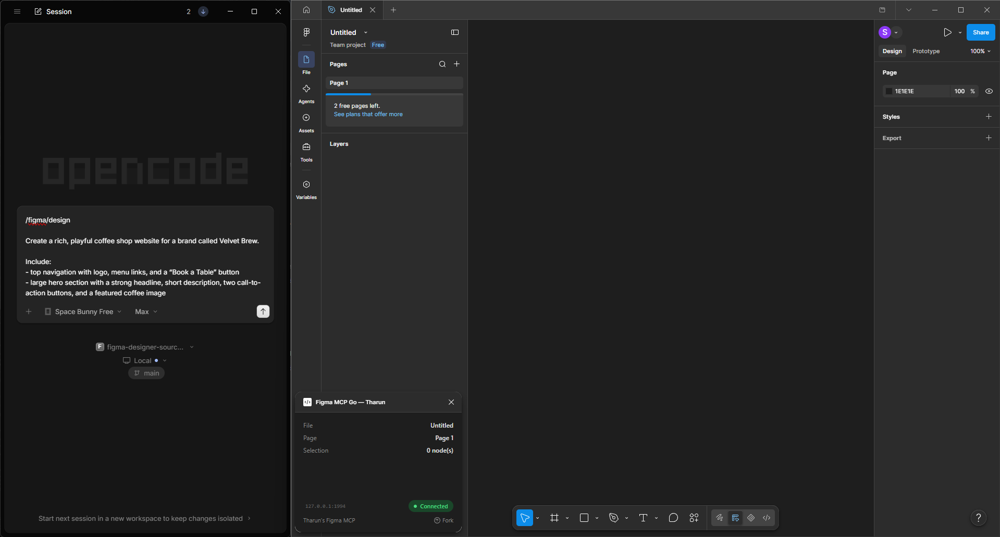
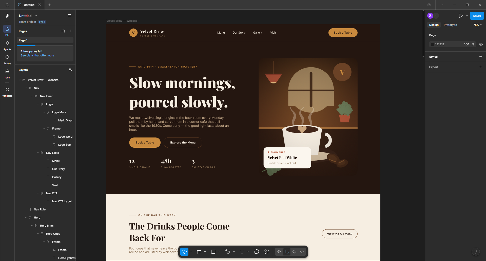
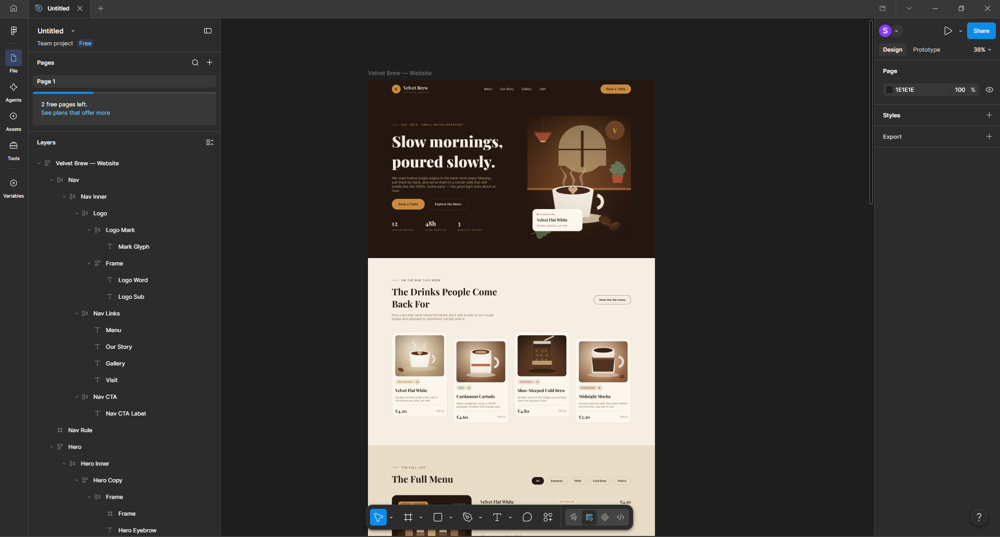
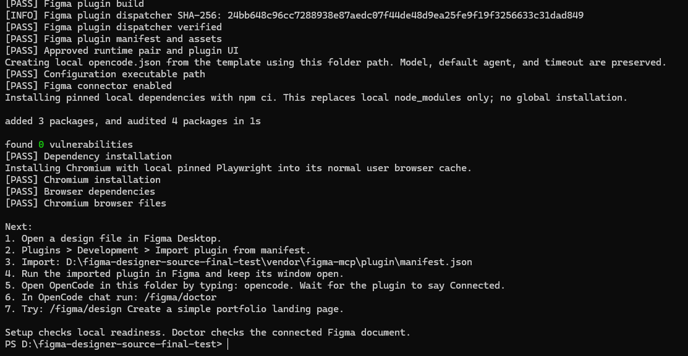
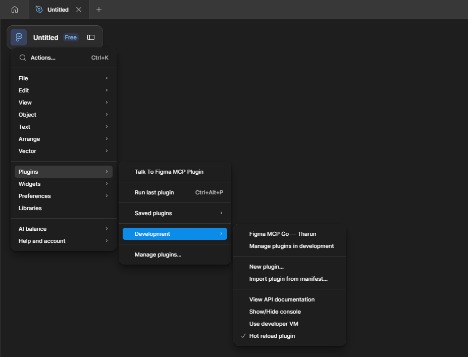
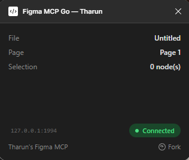
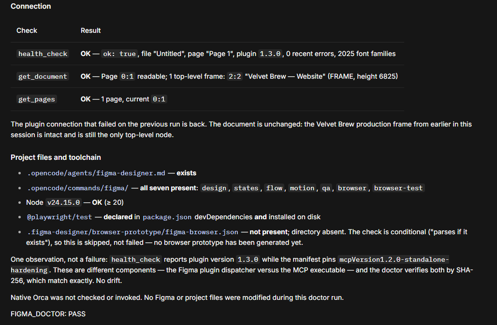

# Figma Designer

Create editable Figma interfaces by describing what you want.

Write your instructions in **OpenCode** and watch the design appear in **Figma Desktop** through the connected plugin. Figma Designer creates real, editable frames, text, components, and layers. It is not an image generator.

**Before**



**After**



## What can it do?

- Create website and app layouts.
- Revise existing designs.
- Create component states, such as hover and pressed buttons.
- Connect screens and add supported interactions.
- Adjust existing transitions and inspect the result.
- Generate and test browser prototypes from a validated interactive design.

## Example

Enter this in **OpenCode chat**:

```text
/figma/design

Create a rich, playful coffee shop website for a brand called Velvet Brew.

Include:
- top navigation with logo, menu links, and a “Book a Table” button
- large hero section with a strong headline, short description, two call-to-action buttons, and a featured coffee image
- featured drinks section with 4 detailed drink cards
- menu section with category filters and a highlighted offer
- “Our Story” section
- testimonials
- photo gallery
- visit/contact section
- footer

Design direction:
- warm coffee-inspired colors
- dark brown sections mixed with soft cream backgrounds
- elegant serif headlines
- large editorial-style images
- varied section layouts
- cozy, premium, handcrafted feeling
- visually rich, not minimal or corporate
```



You can continue editing the generated frames, text, sections, and layers directly in Figma. Creating the layout does not automatically make every control work; use the interaction commands when you need a prototype.

## Install Figma Designer

### 1. Requirements

You need:

- **Windows x64** — the current validated beta platform.
- **Figma Desktop** — download the Windows desktop app from [Figma Downloads](https://www.figma.com/downloads/), install it, and sign in. Your account must allow development-plugin imports.
- **Node.js 20+ and npm** — download the Windows installer from [Node.js](https://nodejs.org/en/download). Keep npm selected during installation. npm is the package installer included with Node.js.
- **OpenCode** — install it using the command below after installing Node.js.
- **Internet access** — for installation and your AI provider.

Open the Windows Start menu, type **PowerShell**, and open it. Check Node.js and npm:

```powershell
node --version
npm --version
```

Node.js should report version 20 or newer. Both commands should print a version. If Windows cannot find them, close and reopen PowerShell after installing Node.js.

In that PowerShell window, install OpenCode using its [official npm installation command](https://opencode.ai/docs/):

```powershell
npm install -g opencode-ai
```

Close and reopen PowerShell, then check:

```powershell
opencode --version
```

Use native Windows PowerShell for this beta. You do not need Go, Bun, or Git for the official Windows ZIP. OpenCode may ask you to sign in to an AI provider; model availability, limits, and costs are separate from Figma Designer.

### 2. Download Figma Designer

Open [GitHub Releases](https://github.com/Chammy01/figma-designer-standalone/releases). Under the release's **Assets**, download:

**Figma-Designer-v1.2.1-beta.1-Windows.zip**

**Do NOT choose “Source code (zip)” or “Source code (tar.gz)” if you only want to use Figma Designer.** Those are source packages for developers and require build tools.

If the Windows ZIP is not listed yet, wait for the official release asset rather than substituting a source archive.

### 3. Extract the ZIP

Right-click the downloaded ZIP and choose **Extract All**. Use a writable folder, for example:

```text
C:\Users\YourName\Documents\Figma-Designer\
```

Open the extracted folder containing `setup.ps1`, `README.md`, and `vendor`. There may be an extra folder inside the extraction location.

**Do not run setup from inside the compressed ZIP viewer.** Keep the extracted files together.

### 4. Open PowerShell in the folder and run setup

1. Open the extracted Figma Designer folder in File Explorer.
2. Click the address bar at the top.
3. Type `powershell` and press **Enter**.
4. In the PowerShell window that opens, paste this command and press **Enter**:

```powershell
powershell -NoProfile -ExecutionPolicy Bypass -File .\setup.ps1 -Configure -InstallDependencies -InstallBrowser
```

Setup verifies the required runtime files, creates local OpenCode configuration if it is missing, installs local dependencies, and installs Chromium for browser tests. Existing configuration is preserved. The execution-policy exception applies only to this process.



This example shows setup after a source build. The official Windows ZIP verifies its included runtime files without rebuilding them. Your folder path will differ.

**If setup shows any FAIL, do not continue.** Follow its recovery message or read [Troubleshooting](docs/TROUBLESHOOTING.md).

## Connect Figma

1. Open **Figma Desktop**.
2. Open or create a **Design file**. A new empty file is a good place to practice.
3. Open the **Figma menu** at the top left, then go to **Plugins → Development → Import plugin from manifest…**.
4. Select `vendor\figma-mcp\plugin\manifest.json` inside your extracted Figma Designer folder. Setup also prints its full location.
5. Run the imported **Figma MCP Go — Tharun** plugin from **Plugins → Development**.
6. Keep the plugin window open.
7. Start OpenCode using the next section, then wait until the plugin says **Connected**. It may say **Disconnected** until OpenCode is running.





## Start Figma Designer

In **PowerShell opened in the extracted Figma Designer folder**, run:

```powershell
opencode
```

Keep OpenCode and the Figma plugin open. On first use, follow OpenCode's sign-in/provider instructions. If needed, enter `/connect` in **OpenCode chat**. If the selected model is unavailable, use `/models` to choose one you can access; setup does not choose a replacement for you. You do not need to run `/init` for this project.

Once the plugin says **Connected**, enter this in **OpenCode chat**, not PowerShell:

```text
/figma/doctor
```

Doctor checks the local runtime, Figma connector, plugin, current document, and browser tools. It reports what needs attention without changing your design.



If Doctor reports that everything is ready and ends with `FIGMA_DOCTOR: PASS`, continue to `/figma/design`.

## Create your first design

Paste this into **OpenCode chat**:

```text
/figma/design

Create a playful website for a cozy neighborhood coffee shop called Little Bean.

Include:
- navigation
- welcoming hero section
- featured drinks
- small about section
- visit-us section
- footer

Make it warm, colorful, charming, and a little quirky.
Avoid a sleek corporate or overly modern look.
```

Watch the layers appear in your open Figma file. Let the command finish before sending another request.

For clearer instructions, include four things:

| Part | What to describe | Example |
| --- | --- | --- |
| **WHAT** | What are you designing? | A coffee shop website. |
| **CONTENT** | What sections or features should it contain? | Drinks, our story, opening hours, and a map. |
| **STYLE** | How should it look and feel? | Warm cream and brown, playful type, and handmade details. |
| **PRIORITIES** | What matters most? | Make opening hours and the visit-us button easy to find. |

## A typical workflow

Use these commands in **OpenCode chat** as your project needs them:

- `/figma/design` → create
- `/figma/revise` → improve or change
- `/figma/states` → component states
- `/figma/flow` → connect screens
- `/figma/interactive` → supported interactions
- `/figma/qa` → inspect and check

You do not need every command for every project. For a static layout, design and revise may be enough. To export a browser prototype, first create and check the interactive design, then run:

```text
/figma/browser
/figma/browser-test
```

See [Commands](docs/COMMANDS.md) for the optional interaction, motion, and browser workflows.

## Revising a design

Name the part to change and what you want to keep. Enter each request in **OpenCode chat**:

```text
/figma/revise

Make the hero feel warmer and more handcrafted.
Reduce the navigation emphasis and make the primary CTA easier to notice.
```

```text
/figma/revise

Make the featured drinks section more visually varied.
Keep the existing content but improve hierarchy and spacing.
```

You can also edit in Figma, then ask for another focused revision. To continue later, open the same Figma file, run its imported plugin, start OpenCode from the same Figma Designer folder, and run `/figma/doctor` again.

If a command times out, do not resend the whole design request. Ask OpenCode to inspect what completed and continue only the missing work.

## Command reference

All `/figma/` commands go in **OpenCode chat**.

| Command | What it does |
| --- | --- |
| `/figma/doctor` | Check readiness. |
| `/figma/design` | Create a new interface or extend a requested part. |
| `/figma/revise` | Change an existing design. |
| `/figma/critique` | Review the current design and identify prioritized quality issues. |
| `/figma/states` | Create component states. |
| `/figma/flow` | Connect screens for a specific journey. |
| `/figma/interactive` | Add supported interactions. |
| `/figma/motion` | Adjust supported transitions on existing interactions. |
| `/figma/qa` | Check the Figma result without changing it. |
| `/figma/browser` | Generate a browser prototype from the validated interactive design. |
| `/figma/browser-test` | Test the generated browser prototype. |
| `/figma/status` | Inspect the current design, connection, and browser-output state. |

## Troubleshooting

Find the problem you see:

| Problem | What to do |
| --- | --- |
| **Figma plugin will not load** | Run setup again from the extracted folder. Resolve every FAIL, then import the manifest from that same folder. Re-extract an incomplete official ZIP. |
| **Plugin does not say Connected** | Keep the plugin open and start `opencode` from the Figma Designer folder. If needed, close and reopen only the plugin window. |
| **`/figma/doctor` fails** | Follow its next corrective step. Check that the design file, plugin, and OpenCode are all open. |
| **`setup.ps1` shows FAIL** | Stop and follow the recovery message. Check that prerequisites are installed and the entire ZIP was extracted. |
| **OpenCode cannot find the Figma connector** | Start it from the folder containing `opencode.json`. Run setup again; it reports a missing or incorrect executable path. |
| **Browser test is unavailable** | In PowerShell in the Figma Designer folder, run the dependency/browser setup command below. Create browser output with `/figma/browser` before testing. |

To install missing browser tools, run in **PowerShell in the Figma Designer folder**:

```powershell
powershell -NoProfile -ExecutionPolicy Bypass -File .\setup.ps1 -InstallDependencies -InstallBrowser
```

More help: [Troubleshooting](docs/TROUBLESHOOTING.md). If you moved the installation, follow [Updating](docs/UPDATING.md) to correct its paths without losing your settings.

## How it works

```text
You
 ↓
OpenCode
 ↓
Figma Designer
 ↓
Figma connector
 ↓
Figma Desktop
 ↓
Editable design
```

OpenCode passes your request through the local connector to the Figma plugin, which creates or edits the document. [Architecture](docs/ARCHITECTURE.md) has the technical details.

## Known limitations

- A prototype is not a full production app. Accounts, saved data, payments, and backend behavior need application code.
- Some interactions and Figma features are limited. Read the reported limitations and try the prototype yourself.
- Browser validation checks specific behaviors; it does not prove every Figma interaction or guarantee visual quality.
- AI provider access, model availability, output quality, usage limits, and cost are separate from this project.
- Windows x64 is the current validated beta platform.

See [Known limitations](docs/KNOWN_LIMITATIONS.md) for more detail.

## Developers / contributors

Git clones and GitHub's Source code archives are supported source installations. They require **Go 1.26.1 for Windows x64**, **Bun 1.4.2**, and the normal Node.js/npm/OpenCode prerequisites. Install Git if you use the clone command.

In PowerShell in the parent folder where you want the checkout:

```powershell
git clone https://github.com/Chammy01/figma-designer-standalone.git
cd figma-designer-standalone
powershell -NoProfile -ExecutionPolicy Bypass -File .\setup.ps1 -Configure -InstallDependencies -InstallBrowser
```

Setup builds missing MCP and plugin runtime files from the pinned source and verifies their exact approved hashes. The repository intentionally excludes generated binaries and plugin `dist` assets; they do not need to be committed. Existing approved runtime files are preserved without rebuilding. Setup does not install Go or Bun.

See [Installation](docs/INSTALLATION.md) for source toolchain installation. Read [Development](docs/DEVELOPMENT.md), [Source Bootstrap](docs/SOURCE_BOOTSTRAP.md), and [Release Packaging](docs/RELEASE_PACKAGING.md) for tests and build details.

## Documentation

- [Quick Start](docs/QUICKSTART.md)
- [Installation](docs/INSTALLATION.md)
- [Troubleshooting](docs/TROUBLESHOOTING.md)
- [Development](docs/DEVELOPMENT.md)
- [Source Bootstrap](docs/SOURCE_BOOTSTRAP.md)
- [Release Packaging](docs/RELEASE_PACKAGING.md)
- [Security](SECURITY.md)
- [Contributing](CONTRIBUTING.md)

## License

Project-owned code and documentation use the [MIT License](LICENSE). Dependencies and bundled third-party material retain their own [licenses and notices](THIRD_PARTY_LICENSES.md).
