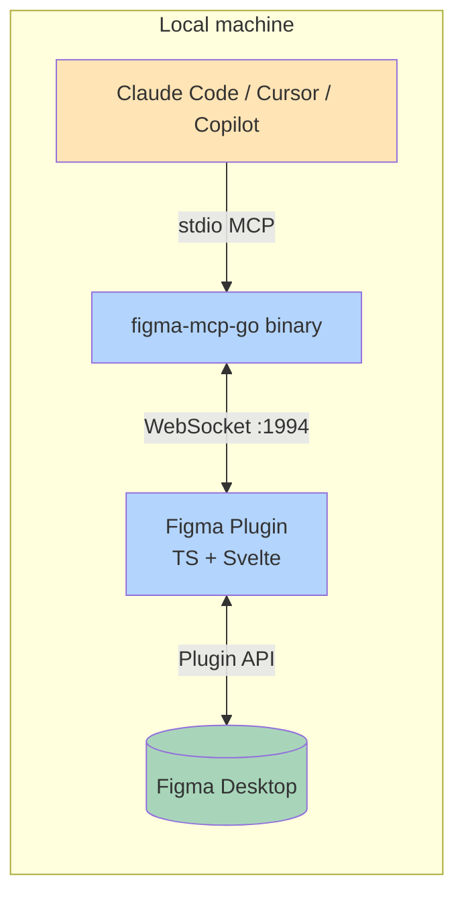
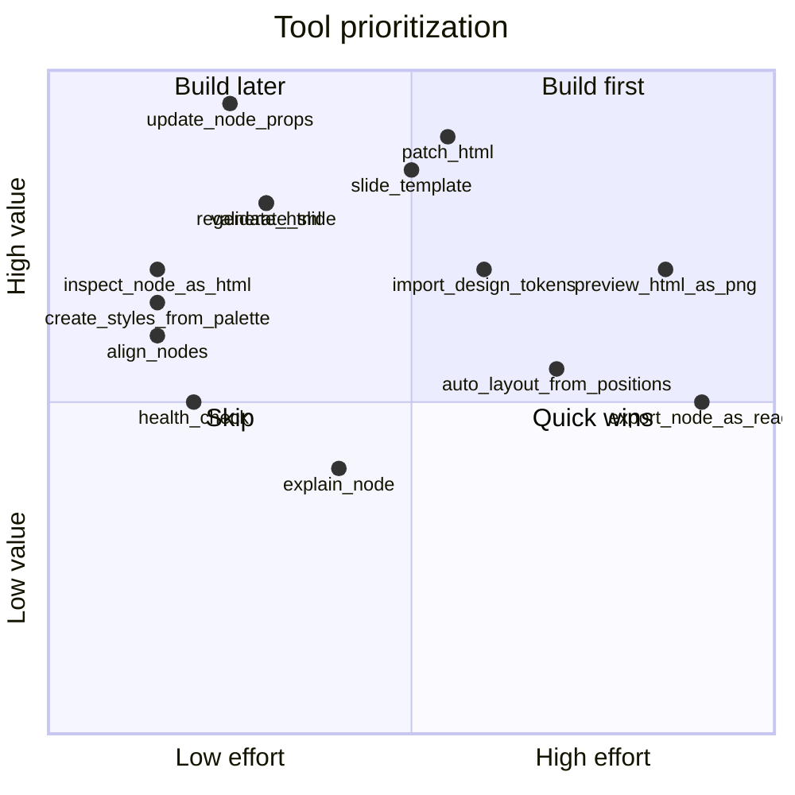
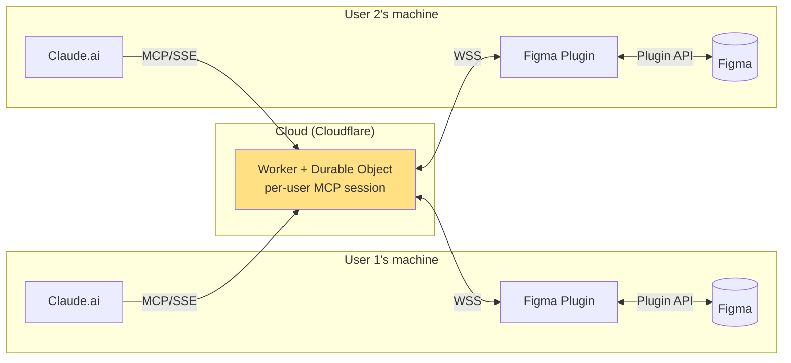
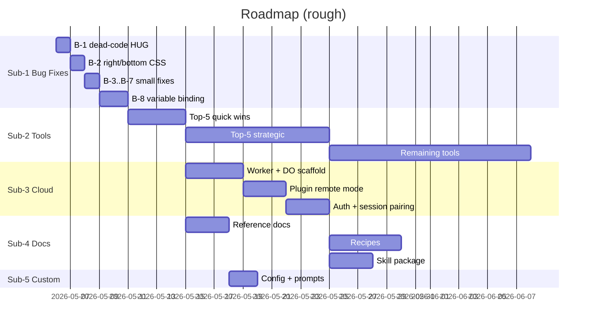

# Roadmap

> **Scope:** End-to-end overhaul of the Figma MCP server + plugin + docs, sequenced as five sub-projects.
> **Goal:** Make this the most agent-friendly Figma toolkit available — so that Claude (and any other coding agent) can design, edit, and iterate in Figma without thrash.

---

## TL;DR

The fork started out solid as a *creation* tool but bad as an *iteration* tool. `write_html` writes nodes; if anything is off, the agent burns tokens on delete-and-rewrite cycles. Five sub-projects, in this order:

1. **Bug Fixes** — surgical patches to `write-html.ts`. **Shipped in v1.3.0.**
2. **Agent Toolkit Overhaul** — ~25 new/refined tools that turn write-once-and-pray into observe-edit-validate. **Shipped in v1.3.0 (28 tools).**
3. **Cloud Connector** — Cloudflare Worker hosting the WebSocket bridge, callable from Claude.ai. Figma still has to be open (see § Cloud). *Exploratory.*
4. **Documentation Package** — `docs/` structured so any agent can pick this up as a skill. **Shipped.**
5. **Fork Customization** — config-driven branding, defaults, and prompts. *Backlog.*

---

## Current State

### Architecture



### Numbers

- **77 tools** today (76 upstream + `apply_styles_batch` from v1.2.0).
- **1,188 lines** of `plugin/src/write-html.ts` doing all HTML→Figma conversion.
- **~14 KLOC** of plugin TypeScript total.
- WebSocket bridge on `ws://127.0.0.1:1994` (configurable via `--ip` / `--port`).
- Plugin only works while Figma Desktop is open and the plugin window is running.

### What works well

- Free tier, no rate limits — the original purpose holds.
- Style binding fixed in v1.2.0 (`setTextStyleIdAsync` instead of broken direct assignment).
- `apply_styles_batch`, `requestId` idempotency, and `boundStyles` in responses are all good agent-ergonomic moves already shipped.

### What hurts today

The **write-then-rewrite loop**. The agent writes HTML → Figma renders it slightly wrong → the agent has no good way to *edit* what's there → easier to delete and re-write. This burns tokens, breaks mental flow, and produces inconsistent results.

---

## Sub-Project 1 — Bug Fixes (SHIPPED IN v1.3.0)

These are concrete, code-level fixes. All eight shipped in v1.3.0 — see [bug-fixes-v1.3.md](bug-fixes-v1.3.md).

### B-1 · "Buttons / headers don't hug content" — DEAD CODE BUG

**File:** `plugin/src/write-html.ts:614-628`

The flex-child sizing decision has duplicate `else if (!pxWidth)` branches:

```ts
if (flexGrow || pctWidth === 100) {
  frame.layoutSizingHorizontal = "FILL";
} else if (!pxWidth) {
  frame.layoutSizingHorizontal = "FILL";          // line 619 — wrong
} else if (!pxWidth) {
  frame.layoutSizingHorizontal = "HUG";           // line 622 — DEAD CODE
}
```

The second `else if (!pxWidth)` is unreachable. So **anything without an explicit width gets FILL instead of HUG**, which is exactly why buttons and headers don't shrink-wrap their content. **Fix:** drop the duplicated branch and make non-flex no-width default to HUG. ~5 lines.

### B-2 · `right` / `bottom` CSS not parsed

**File:** `plugin/src/write-html.ts:419-486` (and elsewhere)

Only `left` and `top` are read. Fix: add a post-positioning pass that, when `right` or `bottom` is present and parent width/height is known, computes `left = parentW - elementW - right`. Document edge cases (parent size unknown, element resizes later).

### B-3 · Text overflows container

**File:** `plugin/src/write-html.ts:381-429`

`textNode.characters = text` is set *before* `resize` and before `textAutoResize`. Figma lays out the text at its default `WIDTH_AND_HEIGHT` first, and the later `resize` doesn't always re-flow. **Fix:** if `width` is set, set `textAutoResize = "HEIGHT"` *before* assigning `characters`, then resize.

### B-4 · Divider with explicit `height: 1px` collapses

**File:** `plugin/src/write-html.ts:625-627`

When parent has auto-layout and the child frame has no children, `layoutSizingVertical = "HUG"` collapses it to 0 even when `pxHeight = 1`. **Fix:** if pxHeight is explicit and small (<5px), force `layoutSizingVertical = "FIXED"` to preserve dividers.

### B-5 · `display: flex` on root frame breaks absolute children

**File:** `plugin/src/write-html.ts:518-569`

No special handling for the root container. If the root has `display: flex`, every child is laid out via flex. **Fix:** when the parsed root is a fixed-size frame *and* its children use `position: absolute`, ignore root flex (treat as `layoutMode = "NONE"`). Alternative: emit a warning back to the agent in the response.

### B-6 · New nodes always created at (0,0)

**File:** `plugin/src/write-html.ts:1010-1078` (`write_html` handler)

`write_html_batch` correctly offsets each slide by `i * (frameWidth + spacing)` but `write_html` doesn't accept any positional input. **Fix:** add optional `x` / `y` params to `write_html`; when omitted, auto-place to the right of existing siblings (last child's `x + width + 80`).

### B-7 · 100px default fallback still applies in non-flex parents

**File:** `plugin/src/write-html.ts:476`

`const width = pxWidth ?? 100;` — when no width is given AND parent isn't auto-layout, the 100px fallback fires. **Fix:** in non-flex contexts, if width is missing, recurse to children first, then HUG to children's bounding box.

### B-8 · Variables can't be bound via HTML class

**File:** `plugin/src/write-html.ts:817-874` (`applyStyleMappingToNode`, `applyDataStyleAttributes`)

Style mapping supports `textStyleId` and `paintStyleId` but not Figma Variables. Workflows that use design tokens via Variables can't bind through `write_html`. **Fix:** extend `StyleMapping` schema to support `{className: { variables: [{ field: "fillColor", id: "VariableID:..." }] }}` and call `node.setBoundVariable(...)`.

### Bug-fix scope summary

| # | Bug | Effort | Risk |
|---|-----|--------|------|
| B-1 | Dead-code branch (HUG never fires) | XS | Low |
| B-2 | `right` / `bottom` CSS | S | Low |
| B-3 | Text overflows container | XS | Low |
| B-4 | Divider collapses | XS | Low |
| B-5 | Root flex breaks children | S | Med |
| B-6 | (0,0) placement | XS | Low |
| B-7 | 100px fallback in non-flex | S | Low |
| B-8 | Variable binding via class | M | Med |

Total: ~1–2 days of work, all in `write-html.ts`. Tests live in `write-html.test.ts` next door.

---

## Sub-Project 2 — Agent Toolkit Overhaul (SHIPPED IN v1.3.0)

The thesis: **today's tools are write-tools. The next generation has to be edit-tools, validate-tools, and observe-tools.** Here's the candidate catalog.

### Tool catalog map

```mermaid
graph TD
    Root[New Tool Catalog] --> A[A. Edit-not-rewrite]
    Root --> B[B. Validation & Preview]
    Root --> C[C. Layout Intelligence]
    Root --> D[D. Component Ergonomics]
    Root --> E[E. Style Ecosystem]
    Root --> F[F. Asset & Export]
    Root --> G[G. Slide / Carousel]
    Root --> H[H. Diagnostics]

    A --> A1[update_node_props]
    A --> A2[patch_html]
    A --> A3[inspect_node_as_html]
    A --> A4[move_to_anchor]

    B --> B1[validate_html]
    B --> B2[preview_html_as_png]
    B --> B3[diff_node_vs_html]
    B --> B4[explain_layout]

    C --> C1[auto_layout_from_positions]
    C --> C2[align_nodes]
    C --> C3[distribute_nodes]
    C --> C4[pack_grid]

    D --> D1[create_component_from_html]
    D --> D2[instantiate_by_name]
    D --> D3[set_instance_overrides_batch]

    E --> E1[create_styles_from_palette]
    E --> E2[create_text_scale]
    E --> E3[import_design_tokens]
    E --> E4[bind_variable_to_style]

    F --> F1[export_node_as_react]
    F --> F2[export_html_self_contained]
    F --> F3[replace_image_globally]

    G --> G1[slide_template]
    G --> G2[regenerate_slide]
    G --> G3[make_slide_grid]
    G --> G4[list_slides]

    H --> H1[health_check]
    H --> H2[get_recent_errors]
    H --> H3[explain_node]

    style A fill:#FFCCBC
    style B fill:#C8E6C9
    style C fill:#BBDEFB
    style D fill:#D1C4E9
    style E fill:#FFF9C4
    style F fill:#F8BBD0
    style G fill:#B2DFDB
    style H fill:#CFD8DC
```



### A · Edit-not-rewrite (highest-leverage category)

Solves the rewrite loop directly.

| Tool | What it does | Why it matters |
|------|--------------|----------------|
| `update_node_props` | One call: any combination of x/y/w/h/fills/strokes/text/fontSize/opacity/rotation/cornerRadius/padding/itemSpacing on one or many nodes | Replaces 5–10 separate set_* calls with one |
| `patch_html` | Apply a CSS-selector-based patch (`.headline { color: red; font-size: 32px }`) to existing nodes by class or `data-name` | Edit a slide without rewriting it |
| `inspect_node_as_html` | Like `get_node` but returns the HTML representation, so the agent thinks in the same model it wrote in | Closes the read/write asymmetry |
| `move_to_anchor` | Move node X to align with anchor Y by (left edge / right edge / center / above / below) | Eliminates manual coordinate math |

### B · Validation & Preview

Catches errors *before* they cost real tool calls.

| Tool | What it does |
|------|--------------|
| `validate_html` | Parse HTML and return what *would* be created (node tree, sizes, warnings) without touching Figma |
| `preview_html_as_png` | Server-side render via headless Chromium → PNG bytes back to the agent. Agent can compare to Figma result and self-correct |
| `diff_node_vs_html` | Render existing Figma node as HTML, diff against intended HTML, return changed properties |
| `explain_layout` | For a node, explain *why* it's the size and position it is (auto-layout? FILL? HUG? parent constraints?). Pure observability |

### C · Layout Intelligence

| Tool | What it does |
|------|--------------|
| `auto_layout_from_positions` | Analyze a frame's children and convert their absolute positions into auto-layout (rows/cols/grid) |
| `align_nodes` | Standard align (top/middle/bottom/left/center/right) on selected nodes |
| `distribute_nodes` | Distribute evenly along an axis |
| `pack_grid` | Auto-arrange selected nodes into N×M grid with spacing |

### D · Component Ergonomics

| Tool | What it does |
|------|--------------|
| `create_component_from_html` | Like `write_html` but the result becomes a Component, not just a Frame |
| `instantiate_by_name` | Make an instance of a component looked up by name (not ID) — easier for agents that don't track IDs |
| `set_instance_overrides_batch` | Apply text/visibility/swap overrides to many instances in one call (e.g., 10 cards in a carousel) |

### E · Style Ecosystem

| Tool | What it does |
|------|--------------|
| `create_styles_from_palette` | Input `{name: hex}` JSON → N paint styles created in one call |
| `create_text_scale` | Input a typography scale (sizes, weights, line-heights) → all corresponding text styles |
| `import_design_tokens` | Accept W3C / Style Dictionary tokens JSON → matching Figma Variables + Styles |
| `bind_variable_to_style` | Link a paint style's color to a variable so it changes per mode |

### F · Asset & Export

| Tool | What it does |
|------|--------------|
| `export_node_as_react` | Generate React + Tailwind code for a node tree |
| `export_html_self_contained` | Single HTML file with embedded CSS and base64 images — drop into a browser to verify |
| `replace_image_globally` | Swap image hash X for hash Y across every node that uses it |

### G · Slide / Carousel

| Tool | What it does |
|------|--------------|
| `slide_template` | Server-side library of slide templates (cover/quote/list/comparison/CTA). Agent picks a template and fills slots — solves "agent reinvents the slide structure each time" |
| `regenerate_slide` | Replace contents of slide N with new HTML, preserving its position, name, and bound styles |
| `make_slide_grid` | Arrange existing slides in a grid (4×3 carousel preview) |
| `list_slides` | Return ordered list of slide frames in the current page |

### H · Diagnostics

| Tool | What it does |
|------|--------------|
| `health_check` | Verify plugin connection, font availability, style ID validity. Returns green/red |
| `get_recent_errors` | Last N failed style bindings, font-load failures, malformed HTML warnings |
| `explain_node` | Plain-English description of a node and its purpose ("This is a 1080×1350 carousel slide with 3 text children and 1 image fill") |

### Tool prioritization (proposal)



**Top 5 to build first** (high value, low effort): `update_node_props`, `inspect_node_as_html`, `validate_html`, `align_nodes`, `create_styles_from_palette`.

**Top 5 strategic bets** (high value, more effort): `patch_html`, `slide_template`, `regenerate_slide`, `auto_layout_from_positions`, `import_design_tokens`.

---

## Sub-Project 3 — Cloud Connector (EXPLORATORY)

### The honest answer to "can Figma stay closed?"

**No.** The reason this MCP works (no rate limits, full write access) is that it bypasses Figma's REST API and uses the live Plugin API. The Plugin API only exists when Figma Desktop is open with the plugin window running. To make Figma "headless" you'd need:

- Figma's REST API → rate-limited, defeats the original purpose. Would also need write-access tokens that Figma only gives Enterprise.
- Headless Figma client (Puppeteer driving the web app) → fragile, likely violates ToS, very high maintenance.
- Figma's still-private Plugin-API-as-a-service → doesn't exist publicly.

So cloud deployment means: **MCP server moves to the cloud, but Figma + plugin still run locally.** The cloud part gets you Claude.ai connector compatibility and team sharing, not background automation.

### Two architecture options

**Option A — Minimal cloud relay**



The Worker pairs each Claude.ai MCP session with the matching plugin via a session token. Stateless except for the active connection.

**Option B — Hybrid (cloud read, local write)**

Same as A, plus a REST-API fallback for read-only tools when Figma isn't open. Gives Claude.ai limited "browse the file" ability when you're away from your machine. More complex; rate-limit risk for reads.

**Recommendation:** A first, B as opt-in later.

### What's required for Option A

- Cloudflare Worker + Durable Object with WebSocket support.
- MCP-over-SSE or MCP-over-HTTP transport (Claude.ai connector format).
- Auth: per-user token. Plugin shows a "Connect" button that calls a Worker endpoint to claim a session ID.
- Plugin update: replace `ws://127.0.0.1:1994` with `wss://figma-mcp.your-domain.workers.dev/ws?session=...`.
- Documentation: how to host your own Worker if you don't trust the shared instance.

### Cost estimate

Cloudflare Workers free tier covers most personal use. Durable Object usage scales with concurrent sessions; figure ~$5/month for moderate single-user usage, more for team use.

---

## Sub-Project 4 — Documentation Package (SHIPPED)

Goal: `docs/` becomes a drop-in skill for any agent.

```
docs/
├── ROADMAP.md                ← this file
├── architecture.md           ← bridge, transport, plugin internals
├── tools-reference.md        ← every tool with examples
├── recipes/
│   ├── carousel-slides.md
│   ├── design-system-bootstrap.md
│   ├── component-library.md
│   └── token-import.md
└── skill/
    ├── SKILL.md              ← drop-in skill description for Claude Cowork / Cursor
    ├── decision-tree.md      ← when to use which tool
    ├── examples/             ← canonical input/output pairs
    └── prompts/              ← system prompt fragments
```

The `skill/` folder follows the `superpowers` skill format so it can be packaged into a `.skill` bundle (or a Claude Cowork plugin).

---

## Sub-Project 5 — Fork Customization (BACKLOG)

Light touches that make the fork easy to personalize:

- `.figmamcp.config.json` for per-project defaults: canvas size, default fonts, default style mapping, slide spacing.
- Configurable plugin display name (already done) + theme color in plugin UI.
- Custom MCP prompts shipped in `internal/prompts/` — e.g., a house slide-style prompt that biases output toward a specific aesthetic.
- Optional auto-update check that pings GitHub for new release.

---

## Sequencing



---

## Open questions

Design questions still open (issues and PRs welcome):

1. **Cloud connector** — is sub-project 3 worth building, or is the local-only bridge good enough for most workflows?
2. **`preview_html_as_png` (server-side rendering)** — high value but high effort (ships a headless Chromium dependency). Worth it? Or skip and trust agent self-reporting via `inspect_node_as_html`?
3. **Docs format** — markdown only, or also generate a JSON tools manifest that agents can introspect at runtime?

---

## Next steps

1. Sub-projects 1, 2, and 4 have shipped (v1.3.x). See [bug-fixes-v1.3.md](bug-fixes-v1.3.md) and [agent-toolkit-v1.3.md](agent-toolkit-v1.3.md) for what landed.
2. Sub-project 5 (config-driven customization) is next in line.
3. Sub-project 3 (cloud connector) stays exploratory until there's a concrete need.
