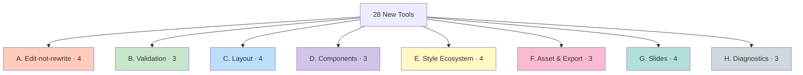

# v1.3.0 Agent Toolkit — Categories A through H

28 new tools added in v1.3.0 to make this MCP the most agent-friendly Figma toolkit available. The thesis: today's tools are *create* tools; the next generation must be *edit*, *validate*, and *observe* tools.



## A — Edit-not-rewrite

The highest-leverage category. Solves the agent rewrite-loop problem.

### `update_node_props`

One call: update any combination of x/y/w/h/fills/strokes/text/fontSize/opacity/etc on one or many nodes.

Replaces N×M separate `set_*` calls with one batched operation.

```json
{
  "updates": [
    {"nodeId": "4:101", "props": {"text": "New title", "fontSize": 48}},
    {"nodeId": "4:102", "props": {"fillColor": "#FF0080", "cornerRadius": 12}}
  ]
}
```

Supported fields: `name, x, y, width, height, fillColor, fillOpacity, strokeColor, strokeWeight, text, fontSize, fontFamily, fontWeight, opacity, rotation, cornerRadius, cornerRadiusTL/TR/BL/BR, paddingTop/Right/Bottom/Left, itemSpacing, visible, layoutSizingHorizontal/Vertical, textAutoResize`.

### `patch_html`

Apply CSS-selector-style patches over a subtree. Selectors:

- `name:Title` — exact match
- `name~:title` — case-insensitive substring
- `type:TEXT` — by node type
- `id:4:101` — by ID
- `*` — all
- Combine with `|`: `type:TEXT | name~:headline`

```json
{
  "targetNodeId": "1:1",
  "patches": [
    {"selector": "name:Title", "props": {"fontSize": 56, "fillColor": "#000"}},
    {"selector": "type:RECTANGLE | name~:divider", "props": {"fillColor": "#E0E0E0"}}
  ]
}
```

### `inspect_node_as_html`

`get_html` with extras: returns HTML body **plus** an outline (parallel `[{nodeId, name, type, depth, ...}]`) so you can address any descendant in a follow-up `update_node_props` without round-tripping.

### `move_to_anchor`

Move a node to align with another by edge or center, with optional gap. Modes: `align-left`, `align-right`, `align-center-x`, `align-top`, `align-bottom`, `align-center-y`, `above`, `below`, `left-of`, `right-of`.

## B — Validation & Preview

### `validate_html`

Dry-run parse: returns the would-be tree, fonts needed, style IDs referenced, and a warnings list — without creating any nodes. Use before `write_html` when you're unsure.

Warnings flag: unsupported CSS (e.g. `margin`), partial percentages, root flex with absolute children, `right` without parent size.

### `diff_node_vs_html`

Compare an existing node to intended HTML. Returns:
- `diffs: [{nodeId, field, current, target}]`
- `patch: [{nodeId, props}]` — feedable directly into `update_node_props`

### `explain_layout`

Plain-English narration of a node's sizing/position factors: layout mode, FILL/HUG/FIXED, padding, item spacing, parent context, constraints.

## C — Layout Intelligence

### `auto_layout_from_positions`

Detects whether children form a row or column from their absolute positions, infers `itemSpacing` from the median gap, then applies auto-layout. Optional `dryRun` returns the inferred values without applying.

### `align_nodes`

Modes: `left`, `right`, `center-x`, `top`, `bottom`, `center-y`. Reference is the bounding box of all selected nodes (or an explicit `referenceNodeId`).

### `distribute_nodes`

Modes: `horizontal-spacing`, `vertical-spacing`, `horizontal-centers`, `vertical-centers`. Optional `gap` overrides even distribution.

### `pack_grid`

Pack N nodes into an M-column grid with consistent gap.

## D — Component Ergonomics

### `create_component_from_html`

`write_html` followed by component conversion. Result is a real Figma `COMPONENT` (not just a `FRAME`).

### `instantiate_by_name`

Look up a component by name (case-insensitive exact match, falls back to substring), instantiate it, optionally apply text/visibility overrides in one call.

### `set_instance_overrides_batch`

Batch overrides across many INSTANCEs:
- `{layerName: "new text"}` — text
- `{layerName: false}` — visibility
- `{swap: {layerName: "TargetComponent"}}` — component swap

## E — Style Ecosystem

### `create_styles_from_palette`

```json
{"Brand/Primary": "#5B5FEF", "Brand/Accent": "#FFD700"}
```

→ N paint styles in one call. Names with `/` group into folders.

### `create_text_scale`

```json
{
  "Heading/Display": {"fontFamily": "Outfit", "fontSize": 96, "fontWeight": "Medium", "lineHeight": 104},
  "Body/Default": {"fontFamily": "Inter", "fontSize": 16, "fontWeight": "Regular", "lineHeight": 24}
}
```

→ Bulk text-style creation.

### `import_design_tokens`

Import W3C-format design tokens (or Style Dictionary export). Supported types: `color`, `dimension`/`spacing`/`size`, `border-radius`/`radius`. Creates a Variable Collection plus optional matching paint/text styles.

### `bind_variable_to_style`

Link a paint style's color to a Variable so the style follows mode changes (light/dark, brand A/B).

## F — Asset & Export

### `export_node_as_react`

Generate a React TSX component using Tailwind utility classes that visually matches the node tree. First-cut implementation handoff — small adjustments expected.

### `export_html_self_contained`

Single-file HTML with embedded CSS and base64 images. Open in any browser to verify visual fidelity.

### `replace_image_globally`

Swap one image hash for another (or for a fresh base64 import) across every node on every page that uses it. "12 cards used the draft headshot — final headshot delivered — one tool call swaps all 12."

## G — Slide / Carousel

### `slide_template`

Library of pre-defined templates: `cover`, `quote`, `list-3`, `comparison`, `cta`. Three actions:
- `list` — return all templates
- `preview` — return a template's HTML
- `instantiate` — create a slide frame and write the template into it (with optional slot values + style mapping)

### `regenerate_slide`

Replace an existing slide's contents with new HTML, preserving position, name, size, and (by default) background fills. The frame stays put; only its children change.

### `make_slide_grid`

Arrange N slide frames into a tidy NxM preview grid for end-of-post review.

### `list_slides`

Return ordered slide-shaped frames in the current page (or a parent subtree). Auto-detects the dominant frame size if not specified.

## H — Diagnostics

### `health_check`

Verifies plugin connection. Returns file name, page name, font family count, style count, variable count, plugin version, recent error count.

### `get_recent_errors`

Last N silent failures from the plugin's ring buffer (last 50 errors). Use after a confusing `write_html` result to see what was skipped.

### `explain_node`

Plain-English description of a node: role (heading / button / image / slide / container), key properties, parent context. Useful as input to an agent's reasoning step.

## Total tool count

| Category | Tools | Cumulative |
|----------|-------|-----------|
| Upstream + apply_styles_batch | 77 | 77 |
| A: Edit | 4 | 81 |
| B: Validation | 3 | 84 |
| C: Layout | 4 | 88 |
| D: Components | 3 | 91 |
| E: Styles | 4 | 95 |
| F: Export | 3 | 98 |
| G: Slides | 4 | 102 |
| H: Diagnostics | 3 | **105** |
