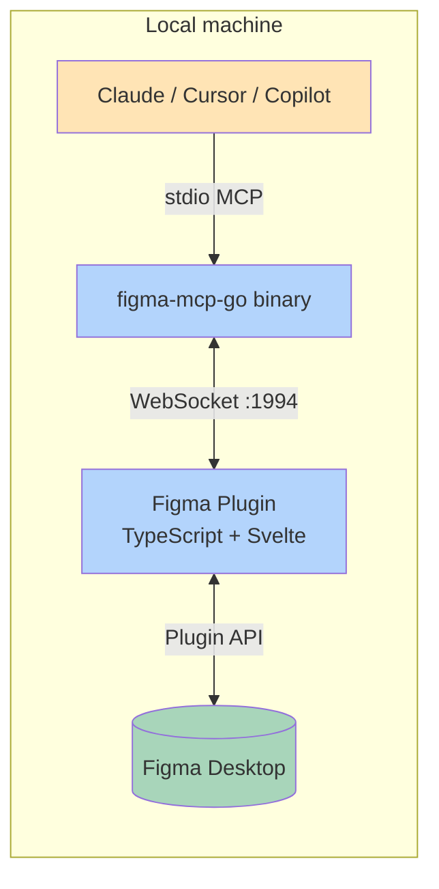
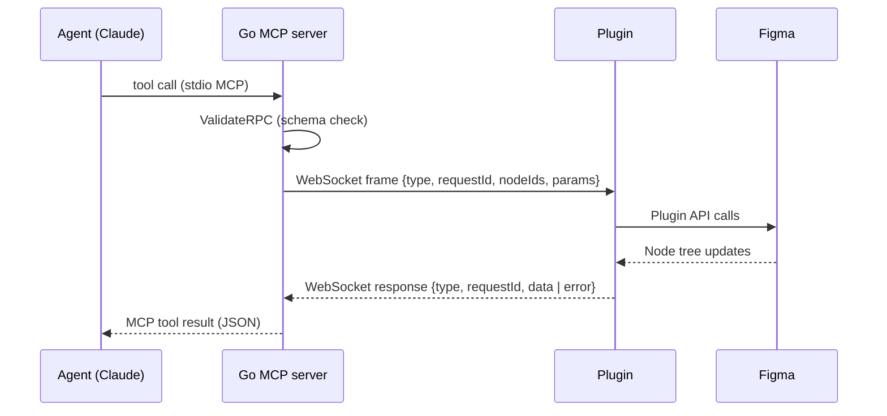

# Architecture

## High-level

**Why this works:** the Plugin API gives full read/write access to the live Figma document and has no rate limit. The REST API has 6/200/600 monthly call limits depending on plan. By bypassing the REST API, we trade portability ("Figma must be open") for unlimited writes.

## Components

### `cmd/figma-mcp-go/main.go`

Entry point. Parses CLI flags, starts the WebSocket server, registers MCP tools and prompts, and serves stdio MCP to the connected agent.

### `internal/`

The Go MCP server.

| File | Responsibility |
|------|----------------|
| `bridge.go` | WebSocket server that the plugin connects to |
| `node.go` | Per-instance state (output dir, election state, last-known plugin) |
| `tools.go` | Top-level registration + helpers (`renderResponse`, path resolution) |
| `tools_read*.go` | Read-only tools (get_node, get_document, get_styles, …) |
| `tools_write.go` | Top-level write registration |
| `tools_write_create.go` | create_frame, create_text, create_rectangle, … |
| `tools_write_modify.go` | set_text, set_fills, move_nodes, resize_nodes, … |
| `tools_write_html.go` | write_html, write_html_batch, get_html (B-6: now accepts x/y) |
| `tools_write_styles.go` | create_paint_style, apply_style_to_node, apply_styles_batch |
| `tools_write_variables.go` | create_variable, bind_variable_to_node |
| `tools_write_components.go` | create_component, swap_component, detach_instance |
| `tools_write_prototype.go` | set_reactions, remove_reactions |
| `tools_write_page.go` | add_page, delete_page, rename_page |
| `tools_edit.go` | **NEW v1.3** — Category A: edit-not-rewrite |
| `tools_validation.go` | **NEW v1.3** — Category B: validation & preview |
| `tools_layout.go` | **NEW v1.3** — Category C: layout intelligence |
| `tools_components_v2.go` | **NEW v1.3** — Category D: component ergonomics |
| `tools_style_ecosystem.go` | **NEW v1.3** — Category E: style ecosystem |
| `tools_export_v2.go` | **NEW v1.3** — Category F: asset & export |
| `tools_slides.go` | **NEW v1.3** — Category G: slide / carousel |
| `tools_diagnostics.go` | **NEW v1.3** — Category H: diagnostics |
| `schema.go` | Cross-cutting input validation |

### `plugin/src/`

The Figma plugin (TypeScript + Svelte 5).

| File | Responsibility |
|------|----------------|
| `main.ts` | Plugin entry, dispatch loop |
| `read-handlers.ts` / `read-*.ts` | Read tool implementations |
| `write-handlers.ts` / `write-*.ts` | Write tool implementations |
| `write-html.ts` | HTML→Figma conversion engine (B-1..B-8 fixes here) |
| `serializers.ts` | Node→JSON conversion shared across handlers |
| `write-helpers.ts` | makeSolidPaint, getParentNode, applyAutoLayout |
| `edit.ts` | **NEW v1.3** — Category A handlers |
| `validation.ts` | **NEW v1.3** — Category B handlers |
| `layout.ts` | **NEW v1.3** — Category C handlers |
| `components-v2.ts` | **NEW v1.3** — Category D handlers |
| `style-ecosystem.ts` | **NEW v1.3** — Category E handlers |
| `export-v2.ts` | **NEW v1.3** — Category F handlers |
| `slides.ts` | **NEW v1.3** — Category G handlers (with built-in template library) |
| `diagnostics.ts` | **NEW v1.3** — Category H handlers + error ring buffer |

## Request flow

## Idempotency (B-6, v1.2.0)

Some tools accept a `requestId`. Completed requests are cached in a 100-entry FIFO map; a retry with the same `requestId` returns the cached result without re-creating nodes. This makes timeout retries safe.

## Error reporting

Plugin handlers can call `recordError(tool, message)` to record silent failures (skipped style bindings, missing fonts, malformed JSON) into a 50-entry ring buffer. Agents query it via `get_recent_errors`.
